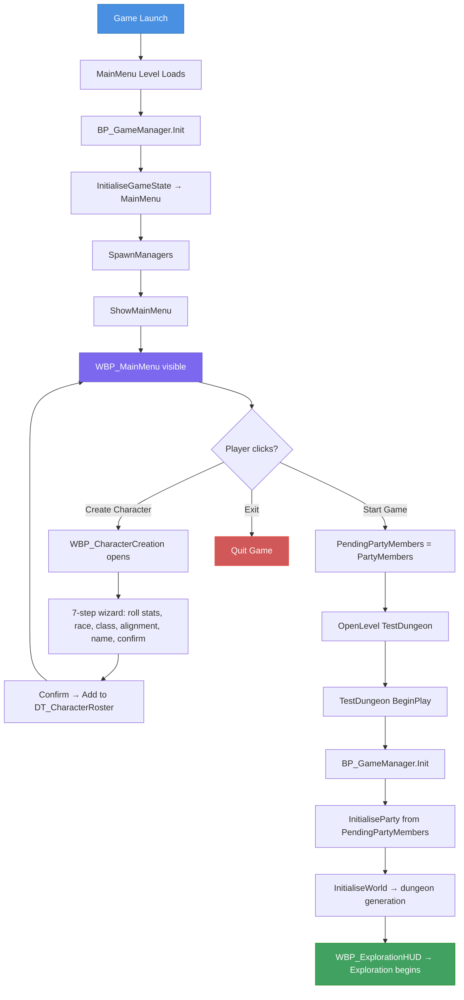

# GB-053: Main Menu System

## Overview

A new `MainMenu` map + `WBP_MainMenu` widget that is the game's entry point. The user creates characters here, then starts the game. The flow integrates with the existing `BP_GameManager` (GameInstance) architecture.

---

## Phase 1: MainMenu Level

**`/Game/Maps/MainMenu`** — new empty level with:
- A `CameraActor` for backdrop
- Level Blueprint `BeginPlay`:
  ```
  Get GameInstance → Cast to BP_GameManager → ShowMainMenu()
  ```

Set as **Game Default Map** in Project Settings → Maps & Modes.

---

## Phase 2: WBP_MainMenu Widget

Full-screen overlay matching the existing dark GoldBox aesthetic:

```
CanvasPanel (root)
├── Border "Background"
│   BrushColor = (R=0.005, G=0.030, B=0.010, A=1.0)  -- same as WBP_ExplorationHUD panels
│   ├── VerticalBox "MenuVBox"
│   │   ├── TextBlock "Title"
│   │   │   Text = "GOLDBOX RPG", large serif font
│   │   ├── Spacer
│   │   ├── Button "Btn_CreateCharacter"
│   │   │   Text = "Create Character"
│   │   ├── Button "Btn_StartGame"
│   │   │   Text = "Start Game"
│   │   │   Enabled only when PartyMembers is not empty
│   │   ├── Button "Btn_Exit"
│   │   │   Text = "Exit"
│   │   └── TextBlock "PartyCount"
│   │       Text = "Party: 0/6 characters"
```

**Variables:**
| Variable | Type | Purpose |
|---|---|---|
| `GameManagerRef` | `BP_GameManager_C` | Access to StartNewGame/QuitGame |
| `PartyManagerRef` | `BP_PartyManager_C` | Character creation pipeline |
| `CharacterCreationWidget` | `WBP_CharacterCreation_C` | Reference to open creation screen |

**Functions:**
- `Initialise(GameManager, PartyManager)` — stores refs, binds `OnPartyUpdated` delegate, calls `RefreshPartyCount`
- `RefreshPartyCount()` — updates "Party: X/6" text, enables/disables Start Game button
- `OnCreateCharacter()` — Create Widget WBP_CharacterCreation → Initialise(PartyManager) → AddToViewport
- `OnStartGame()` — GameManagerRef.StartNewGame()
- `OnExit()` — GameManagerRef.QuitGame()

---

## Phase 3: WBP_CharacterCreation Widget 🚧

**Status:** In progress. Steps 0–4 complete, ConfirmPanel widget tree built, save logic pending.

**Architecture:** 7-step WidgetSwitcher with Next/Back navigation and per-step validation gates.

> **Deviation from original spec:** Original design was a single-panel form with ComboBoxes. Actual implementation uses a 7-panel wizard flow (one step per screen) with boolean selection gates (`bChooseRace`, `bChooseClass`, `bChooseAlignment`) and an AND-chain gate on the Next button. CharacterName stored as Text (not String). Alignment uses `E_Morality` (7 values) instead of D&D 3×3 `E_Alignment`. Save target is `DT_CharacterRoster` DataTable, not `BP_PartyManager.AddCharacter`.

### Panel Structure

| Index | Panel | Status |
|---|---|---|
| 0 | `RollStatsPanel` | ✅ Complete |
| 1 | `ChooseRacepanel` | ✅ Complete |
| 2 | `ChooseClassPanel` | ✅ Complete |
| 3 | `ChooseAlignmentPanel` | ✅ Complete |
| 4 | `NameEntryPanel` | ✅ Complete |
| 5 | `PortraitPanel` | ❌ Empty placeholder |
| 6 | `ConfirmPanel` | 🚧 Widget tree built |

### Key Variables

| Variable | Type | Default |
|---|---|---|
| `CurrentStepIndex` | int32 | 0 |
| `MightScore`–`PresenceScore` | int32 (×6) | 0 |
| `SelectedRace` | E_Race (byte) | Human |
| `SelectedClass` | E_CharacterClass (byte) | Warden |
| `SelectedAlignment` | E_Morality (byte) | Righteous |
| `CharacterName` | Text | (empty) |
| `bChooseRace`/`bChooseClass`/`bChooseAlignment` | bool | False |

### Functions

| Function | Purpose |
|---|---|
| `UpdateNavigation(step)` | Switches panels, updates header, toggles Back button, sets Next→Confirm on step 6 |
| `ValidateRollStats()` → bool | Pure: all 6 stats > 0 |
| `SelectRace/Class/Alignment(in)` | Sets selected enum, highlights button, sets selection gate flag |
| `GenerateRandomName()` → Text | Pure: random syllable-based name generator |
| `GetRaceDisplayName/GetClassDisplayName/GetAlignmentDisplayName` | Pure: enum → display Text |
| `PopulateConfirmPanel()` | ❌ Not yet built — fills ConfirmPanel TextBlocks |

### Next Button Gate (AND Chain)

```
Advance if ALL of:
  (step != 6 OR ValidateRollStats)
  (step != 1 OR bChooseRace)
  (step != 2 OR bChooseClass)
  (step != 3 OR bChooseAlignment)
  (step != 4 OR CharacterName != "")
```

### Pending Work

- [ ] `PopulateConfirmPanel` function
- [ ] Branch Next button for step 6 → save flow
- [ ] `Make S_Character` → `Add Data Table Row` (DT_CharacterRoster) → `Remove from Parent`
- [ ] PortraitPanel (step 5)

Full details: see `Character_Creation_Dev_Guide.md`.

---

## Phase 4: BP_GameManager Changes

**Critical constraint:** `GameInstance.Init` fires **once** per game session, not per level. When `OpenLevel` loads TestDungeon, Init does NOT run again. Party data must be stored on the GameInstance (which persists) and restored into the newly spawned PartyManager actor.

**New variable on BP_GameManager:**
| Variable | Type | Purpose |
|---|---|---|
| `PendingPartyMembers` | `TArray<FS_Character>` | Party data that survives level transitions |

**Modified `Init`:**
```
Event ReceiveInit:
  GetCurrentLevelName
  if "TestSuite": return (skip — existing)
  
  InitialiseGameState          // sets CurrentGameState = MainMenu
  SpawnManagers                // spawns all managers (unchanged)
  
  if level == "MainMenu":
    ShowMainMenu()             // CreateWidget WBP_MainMenu → Initialise → AddToViewport
  else:
    InitialiseParty            // populates PartyManager from PendingPartyMembers if non-empty, else test data
    InitialiseWorld            // LoadMap + GenerateDungeon
```

**New functions:**
| Function | Behavior |
|---|---|
| `ShowMainMenu()` | CreateWidget(WBP_MainMenu) → Initialise(Self, PartyManager) → AddToViewport |
| `StartNewGame()` | PendingPartyMembers = PartyManager.PartyMembers → OpenLevel("TestDungeon") |
| `QuitGame()` | Execute Console Command "quit" |

**Modified `InitialiseParty`:**
```
if PendingPartyMembers is not empty:
  for each character in PendingPartyMembers:
    PartyManager.AddCharacter(character)
else:
  PartyManager.InitialiseTestParty()   // fallback for direct editor PIE in TestDungeon
```

---

## Phase 5: What Doesn't Happen (Deferred)

- **No portrait selection** — S_Character has `Protrait (int32)` field, but no portrait data table exists. Field stays zero.
- **No spell memorisation** — full spell system needs a spell data table.
- **No equipment selection** — items need item data table.
- **No save/load** — party only exists in memory.
- **No delete character** — can be added later to the main menu as a small feature.
- **No "Camp" or "Load Game" buttons** — can be added once those systems exist.

---

## Flow Diagram



---

## Assets Summary

| Asset | Action | Path |
|---|---|---|
| MainMenu | New level | `/Game/Maps/MainMenu` |
| WBP_MainMenu | New widget | `/Game/Blueprints/UI/WBP_MainMenu` |
| WBP_CharacterCreation | In progress | `/Game/Blueprints/UI/WBP_CharacterCreation` |
| DT_CharacterRoster | Created | `/Game/Blueprints/Data/DT_CharacterRoster` |
| BP_GameManager | Modify | `/Game/Blueprints/Core/BP_GameManager` |
| Project Settings | Modify | Game Default Map → MainMenu |
