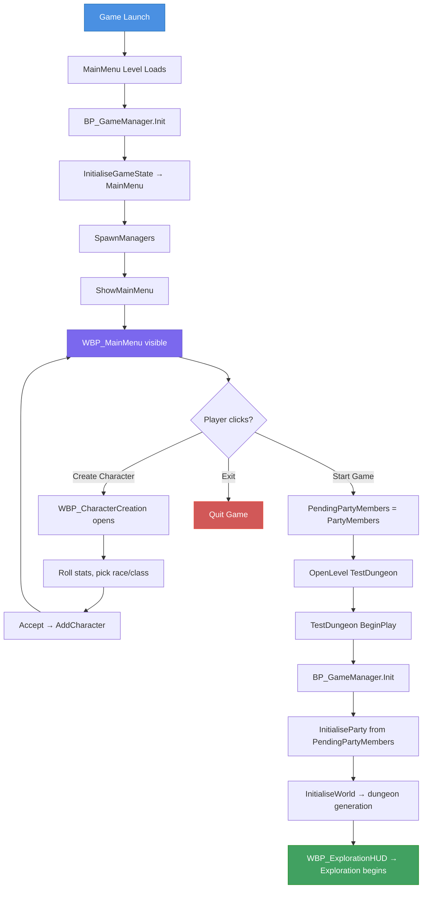

# GB-053: Main Menu System

## Overview

A new `MainMenu` map + `WBP_MainMenu` widget that is the game's entry point. The user creates characters here, then starts the game. The flow integrates with the existing `BP_GameManager` (GameInstance) architecture.

---

## Phase 1: MainMenu Level

**`/Game/Maps/MainMenu`** — new empty level with:
- A `CameraActor` for backdrop
- Level Blueprint `BeginPlay`:
  ```
  Get GameInstance → Cast to BP_GameManager → ShowMainMenu()
  ```

Set as **Game Default Map** in Project Settings → Maps & Modes.

---

## Phase 2: WBP_MainMenu Widget

Full-screen overlay matching the existing dark GoldBox aesthetic:

```
CanvasPanel (root)
├── Border "Background"
│   BrushColor = (R=0.005, G=0.030, B=0.010, A=1.0)  -- same as WBP_ExplorationHUD panels
│   ├── VerticalBox "MenuVBox"
│   │   ├── TextBlock "Title"
│   │   │   Text = "GOLDBOX RPG", large serif font
│   │   ├── Spacer
│   │   ├── Button "Btn_CreateCharacter"
│   │   │   Text = "Create Character"
│   │   ├── Button "Btn_StartGame"
│   │   │   Text = "Start Game"
│   │   │   Enabled only when PartyMembers is not empty
│   │   ├── Button "Btn_Exit"
│   │   │   Text = "Exit"
│   │   └── TextBlock "PartyCount"
│   │       Text = "Party: 0/6 characters"
```

**Variables:**
| Variable | Type | Purpose |
|---|---|---|
| `GameManagerRef` | `BP_GameManager_C` | Access to StartNewGame/QuitGame |
| `PartyManagerRef` | `BP_PartyManager_C` | Character creation pipeline |
| `CharacterCreationWidget` | `WBP_CharacterCreation_C` | Reference to open creation screen |

**Functions:**
- `Initialise(GameManager, PartyManager)` — stores refs, binds `OnPartyUpdated` delegate, calls `RefreshPartyCount`
- `RefreshPartyCount()` — updates "Party: X/6" text, enables/disables Start Game button
- `OnCreateCharacter()` — Create Widget WBP_CharacterCreation → Initialise(PartyManager) → AddToViewport
- `OnStartGame()` — GameManagerRef.StartNewGame()
- `OnExit()` — GameManagerRef.QuitGame()

---

## Phase 3: WBP_CharacterCreation Widget

```
CanvasPanel (root)
├── Border "CreationBorder"
│   Padding = 16, centered
│   ├── VerticalBox "CreationVBox"
│   │   ├── TextBlock "Title"  → "CREATE CHARACTER"
│   │   ├── HorizontalBox: TextBlock "Name:" + EditableTextBox "NameInput"
│   │   ├── HorizontalBox: TextBlock "Race:" + ComboBox "RaceCombo" (E_Race values)
│   │   ├── HorizontalBox: TextBlock "Class:" + ComboBox "ClassCombo" (E_CharacterClass)
│   │   ├── HorizontalBox: TextBlock "Multi:" + ComboBox "MultiCombo" (E_CharacterClass)
│   │   ├── HorizontalBox: TextBlock "Align:" + ComboBox "AlignCombo" (E_Alignment)
│   │   ├── HorizontalBox: TextBlock "Gender:" + ComboBox "GenderCombo" (Male/Female)
│   │   ├── Separator
│   │   ├── TextBlock "AbilityLabel"  → "ABILITY SCORES  (3d6 each)"
│   │   ├── Button "Btn_RollAll"  → "Roll All"
│   │   ├── GridPanel "AbilityGrid" (6 rows)
│   │   │   ├── "Might:"     TextBlock + Button "Roll"
│   │   │   ├── "Acuity:"    TextBlock + Button "Roll"
│   │   │   ├── "Resolve:"   TextBlock + Button "Roll"
│   │   │   ├── "Reflex:"    TextBlock + Button "Roll"
│   │   │   ├── "Vigor:"     TextBlock + Button "Roll"
│   │   │   └── "Presence:"  TextBlock + Button "Roll"
│   │   ├── Separator
│   │   ├── HorizontalBox
│   │   │   ├── Button "Btn_Accept"  → "Accept"
│   │   │   └── Button "Btn_Cancel"  → "Cancel"
```

**Variables:**
| Variable | Type |
|---|---|
| `PartyManagerRef` | `BP_PartyManager_C` |
| `RolledMight` | `int32` |
| `RolledAcuity` | `int32` |
| `RolledResolve` | `int32` |
| `RolledReflex` | `int32` |
| `RolledVigor` | `int32` |
| `RolledPresence` | `int32` |

**Logic:**
- `RollAbilityScore()` → `BPL_RulesLibrary.DiceRoll(3, 6)` → 3d6
- `RollAll()` → calls DiceRoll 6 times, updates all TextBlocks
- `BuildCharacter()`:
  1. Construct `FS_Character` from all widget fields
  2. `MaxHP = BPL_RulesLibrary.ComputeMaxHP(Level=1, Might, Vigor)`
  3. `CurrentHP = MaxHP`
  4. `Level = 1`, `XP = 0`
  5. All other fields default/zero
- `OnAccept()` → validate name not empty → BuildCharacter → PartyManager.AddCharacter → RemoveFromParent
- `OnCancel()` → RemoveFromParent
- Party capped at 6 (disable "Create Character" on main menu when full)

---

## Phase 4: BP_GameManager Changes

**Critical constraint:** `GameInstance.Init` fires **once** per game session, not per level. When `OpenLevel` loads TestDungeon, Init does NOT run again. Party data must be stored on the GameInstance (which persists) and restored into the newly spawned PartyManager actor.

**New variable on BP_GameManager:**
| Variable | Type | Purpose |
|---|---|---|
| `PendingPartyMembers` | `TArray<FS_Character>` | Party data that survives level transitions |

**Modified `Init`:**
```
Event ReceiveInit:
  GetCurrentLevelName
  if "TestSuite": return (skip — existing)
  
  InitialiseGameState          // sets CurrentGameState = MainMenu
  SpawnManagers                // spawns all managers (unchanged)
  
  if level == "MainMenu":
    ShowMainMenu()             // CreateWidget WBP_MainMenu → Initialise → AddToViewport
  else:
    InitialiseParty            // populates PartyManager from PendingPartyMembers if non-empty, else test data
    InitialiseWorld            // LoadMap + GenerateDungeon
```

**New functions:**
| Function | Behavior |
|---|---|
| `ShowMainMenu()` | CreateWidget(WBP_MainMenu) → Initialise(Self, PartyManager) → AddToViewport |
| `StartNewGame()` | PendingPartyMembers = PartyManager.PartyMembers → OpenLevel("TestDungeon") |
| `QuitGame()` | Execute Console Command "quit" |

**Modified `InitialiseParty`:**
```
if PendingPartyMembers is not empty:
  for each character in PendingPartyMembers:
    PartyManager.AddCharacter(character)
else:
  PartyManager.InitialiseTestParty()   // fallback for direct editor PIE in TestDungeon
```

---

## Phase 5: What Doesn't Happen (Deferred)

- **No portrait selection** — S_Character has `Protrait (int32)` field, but no portrait data table exists. Field stays zero.
- **No spell memorisation** — full spell system needs a spell data table.
- **No equipment selection** — items need item data table.
- **No save/load** — party only exists in memory.
- **No delete character** — can be added later to the main menu as a small feature.
- **No "Camp" or "Load Game" buttons** — can be added once those systems exist.

---

## Flow Diagram



---

## Assets Summary

| Asset | Action | Path |
|---|---|---|
| MainMenu | New level | `/Game/Maps/MainMenu` |
| WBP_MainMenu | New widget | `/Game/Blueprints/UI/WBP_MainMenu` |
| WBP_CharacterCreation | New widget | `/Game/Blueprints/UI/WBP_CharacterCreation` |
| BP_GameManager | Modify | `/Game/Blueprints/Core/BP_GameManager` |
| Project Settings | Modify | Game Default Map → MainMenu |
